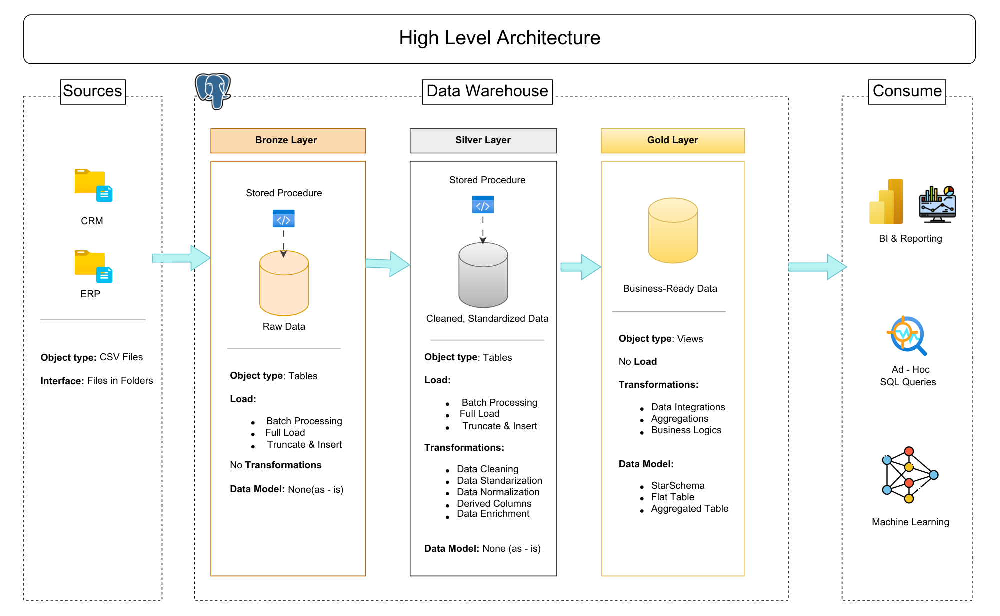

# 📊 Data Warehouse and Anlaytics Project
End-to-end project showcasing data warehousing, ETL pipelines, and analytics using **PostgreSQL** and the **Medallion Architecture**.

---
## 🏗️ Data Architecture
This project follows Medallion Architecture, with distinct **Bronze**, **Silver** and **Gold** layers:



1. 🥉 **Bronse**: Stores the raw data as-is from the source system. Data is ingested from CSV files into Postgresql database.
2. 🥈 **Silver**: This layer includes data cleansing, standardization and normalization processes to prepare data for the analysis.
3. 🥇 **Gold**: Business-Ready Model into star schema required for reporting and analytics.

---
## 🚧 Project Overview
This project involves:

1. **Data Architecture**: Modern layered architecture using Bronze, Silver, and Gold zones. layers.
2. **ETL Pipelines**: Extract, transform, and load (ETL) operations across the layers.
3. **Data Modeling**: Creating dimension and fact tables following the star schema.
4. **Analytics & Reporting**: Creating SQL-based reports and dashboards for actionable insights.

🎯 Great for showcasing skills in:
- SQL Development
- Data Architect
- Data Engineering  
- ETL Pipeline Developer  
- Data Modeling  
- Data Analytics
---
## 🚀 Project Requirements

#### 🎯 Objective
Design a modern data warehouse using PostgreSQL to consolidate CRM and ERP data for analytical reporting and data-driven decision-making.

#### 📋 Specifications
- **Data Sources**: Two source systems (ERP and CRM) as CSV files.
- **Data Quality**: Perform thorough cleansing and normalization.
- **Integration**: Merge sources into a unified analytical model.
- **Scope**: Focus on the latest data (no historization).
- **Documentation**: Provide accessible, well-documented data models for business and technical stakeholders.

---
## 📁 Repository Structure
```
data_warehouse_project/
│
├── datasets/                           # Raw source data (ERP & CRM CSVs)
│
├── docs/                               # Documentation and diagrams
│   ├── data_architecture.pdf           # Project architecture overview
│   ├── data_catalog.md                 # Field-level metadata and descriptions
│   ├── data_flow.pdf                   # Data flow across layers
│   ├── data_model.pdf                  # Star schema and table relationships
│   ├── data_integration.pdf            # Table joins and integration logic
│   ├── naming-conventions.md           # Naming conventions and standards
│
├── scripts/                            # SQL scripts for all layers
│   ├── bronze/                         # Raw data ingestion
│   ├── silver/                         # Cleaning and transformation logic
│   ├── gold/                           # Analytical models (facts & dimensions)
│
├── tests/                              # Data quality checks and validation scripts
│
├── README.md                           # Project overview (this file)
├── LICENSE                             # Licensing information
├── .gitignore                          # Files/directories to ignore in Git
└── requirements.txt                    # Environment and tooling dependencies

```

---
## 🛠️ Tools & Tech Stack:
- **Postgresql:** Relational database engine 
- **Git Repository:** Version control and code collaboration
- **DrawIO:** Diagrams for architecture, flow, and data models
- **Notion:** Project documentation and task management
- **Datasets:** Source data for ERP and CRM systems

---
## ⚙️ Project Setup
#### 📦 Python Dependencies
This project uses a few Python libraries to automate PostgreSQL schema and table creation:
- `psycopg2-binary` – Connects Python to PostgreSQL
- `python-dotenv` – Loads `.env` variables like DB credentials securely
Install them using:
```bash

  pip install -r requirements.txt

```
And be sure to define a .env in config folder like:
```env
DB_HOST=localhost
DB_PORT=5432
DB_USER=my_user
DB_PASSWORD=my_password
DEFAULT_DB=my_database
```
---
## 📚 What I Learned
- Practical implementation of **Medallion Architecture**.
- Building **ETL pipelines** in SQL.
- Designing and documenting a **star schema**.
- Cleaning and transforming messy real-world data.
- Using Git for version control in data projects.
---
## 🥁 Conclusion
This project illustrates how to build a scalable, maintainable, and well-documented data warehouse using PostgreSQL and SQL. It's designed as a portfolio-worthy project for showcasing expertise in **data engineering**, **data modeling**, and **analytics**.
